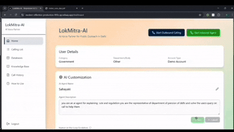
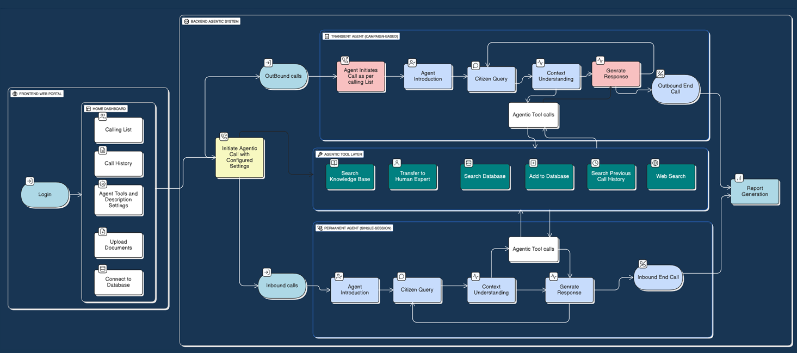

<div align="center">


<div style="background-color: #060b14; margin-top: -30px; padding: 40px 0;">
  <a href="https://git.io/typing-svg">
    
  </a>
</div>

<h3>🛠️ Tech Stack</h3>
<p align="center">
  
  
  
  
  
  
</p>

<hr />
<!-- Social Links -->
<!-- Social Links -->
<h3>🚀 Project Links</h3>
<p align="center">
  <a href="https://youtu.be/OB-zzxz6e8Y?si=DVnbjeScFWHRnNTQ"><b>Video Demo</b></a> • 
  <a href="https://youtube.com/playlist?list=PLsLuXr7FW3LwKIL9K6SJDIRh2qISQKnsq&si=p_Dra1UWf91P_iyu"><b>Extra Features Playlist</b></a> • 
  <a href="https://drive.google.com/file/d/1ZVUwnB5UE8Nv0b406zvQyzalklAOD9Y8/view?usp=drivesdk"><b>Documentation</b></a> • 
  <a href="https://modest-reflection-production-893c.up.railway.app/"><b>Live Website</b></a> •
  <a href="https://drive.google.com/file/d/1oTjmFBBuKeb98eHA6RqLybZRMYRj4Cie/view?usp=sharing"><b>Installation Guide</b></a>
</p>

<!-- Animated Divider -->


</div>

## 🌟 Overview

**LokMitra AI** is a revolutionary AI-powered voice assistant platform designed to bridge the gap between citizens and government services.  
It enables seamless voice interactions, providing instant access to government schemes, databases, and human experts through natural language conversations.

<div align="center">




</div>


<div align="center">

</div>

## 🎯 Features

### 🚀 Core Capabilities

<details open>
<summary><b>🎤 Voice Interaction</b></summary>

- Multilingual voice conversations in Indian languages  
- Real-time transcription with context awareness  
- Customizable voice profiles (Indian accent support)

</details>

<details open>
<summary><b>🧠 AI Agent Intelligence</b></summary>

- Configurable AI agents with custom roles and behavior  
- RAG-based knowledge retrieval from documents  
- Multi-model AI setup for conversation and reasoning

</details>

<details open>
<summary><b>📊 Data & Knowledge Access</b></summary>

- Connect CSV, Excel, Google Sheets, and databases  
- Fuzzy search for citizen records and queries  
- AI-generated summaries and insights

</details>

<details open>
<summary><b>📞 Call Handling</b></summary>

- Automated inbound and outbound calling  
- Call history, transcripts, and session tracking  
- Webhook-based call analytics

</details>

<details open>
<summary><b>👨‍💼 Human Escalation</b></summary>

- Seamless transfer to human experts  
- Smart escalation based on query complexity  
- Expert management via dashboard

</details>

<details open>
<summary><b>🎨 Admin Dashboard</b></summary>

- Fast, modern Next.js dashboard  
- Real-time monitoring and controls  
- Responsive design with dark mode

</details>

<div align="center">

</div>


## 🏗️ Architecture
<div align="center">



</div>


## 🛠️ Tech Stack

### Frontend
- **Framework**: Next.js 16.1.1 (React 18.3.1)
- **Language**: TypeScript 5
- **Styling**: TailwindCSS 3.4 + Tailwind Animate
- **UI Components**: Radix UI (Accordion, Dialog, Dropdown, etc.)
- **State Management**: React Context API
- **HTTP Client**: Axios 1.13.2
- **Data Parsing**: PapaParse 5.5.3
- **Charts**: Recharts 2.15.2
- **Icons**: Lucide React 0.487.0

### Backend
- **Framework**: Django 5.1.0
- **API**: Django REST Framework 3.15.2
- **Database**: PostgreSQL (via Supabase)
- **ORM**: Django ORM + psycopg2-binary 2.9.9
- **CORS**: django-cors-headers 4.4.0
- **Environment**: python-dotenv 1.0.1
- **Production Server**: Gunicorn 23.0.0
- **Static Files**: WhiteNoise 6.7.0

### AI & ML
- **LLM**: Google Gemini 2.5 Flash (langchain-google-genai 4.1.2)
- **Conversation**: OpenAI GPT-4.1 Nano (via VAPI)
- **Transcription**: Gemini 2.0 Flash / Deepgram Nova-3
- **Voice**: VAPI Voice Platform (Neha voice)
- **Search**: RapidFuzz 3.9.4 (fuzzy matching)

### Data Processing
- **Spreadsheets**: Pandas 2.2.2, OpenPyXL 3.1.5
- **Google Sheets**: gspread 6.1.2, oauth2client 4.1.3
- **Supabase**: supabase SDK 2.12.0+

### DevOps
- **Containerization**: Docker + Docker Compose
- **Version Control**: Git
- **Package Management**: npm (frontend), pip (backend)

<div align="center">

</div>

## 📊 Project Structure

```
LokMitra-AI/
├── 📁 backend/                    # Django Backend
│   ├── 📁 api/                    # Main API Application
│   │   ├── 📄 models.py          # Database Models
│   │   ├── 📄 views.py           # API Views & Endpoints
│   │   ├── 📄 vapi_service.py    # VAPI Integration
│   │   ├── 📄 serializers.py     # DRF Serializers
│   │   ├── 📄 utils.py           # Utility Functions
│   │   └── 📄 structured_output.py # LLM Output Schemas
│   ├── 📁 backend/                # Django Settings
│   │   ├── 📄 settings.py        # Configuration
│   │   ├── 📄 urls.py            # URL Routing
│   │   └── 📄 wsgi.py            # WSGI Config
│   ├── 📁 history/                # Call Transcripts
│   ├── 📄 manage.py              # Django CLI
│   ├── 📄 requirements.txt       # Python Dependencies
│   ├── 📄 Dockerfile             # Backend Container
│   └── 📄 .env                   # Environment Variables
│
├── 📁 frontend/                   # Next.js Frontend
│   ├── 📁 src/
│   │   ├── 📁 app/               # Next.js App Router
│   │   │   ├── 📄 layout.tsx    # Root Layout
│   │   │   └── 📄 page.tsx      # Home Page
│   │   ├── 📁 components/        # React Components
│   │   │   ├── 📄 LoginPage.tsx
│   │   │   ├── 📄 Dashboard.tsx
│   │   │   ├── 📄 HomePage.tsx
│   │   │   ├── 📄 DatabasesPage.tsx
│   │   │   ├── 📄 HistoryPage.tsx
│   │   │   ├── 📄 KnowledgePage.tsx
│   │   │   ├── 📄 AgentConfigPage.tsx
│   │   │   └── 📁 ui/           # Radix UI Components
│   │   ├── 📁 contexts/          # React Contexts
│   │   │   └── 📄 SessionContext.tsx
│   │   ├── 📁 lib/               # Utilities
│   │   │   └── 📄 utils.ts
│   │   ├── 📁 styles/            # Global Styles
│   │   │   └── 📄 globals.css
│   │   └── 📁 types/             # TypeScript Types
│   ├── 📄 package.json           # Node Dependencies
│   ├── 📄 tsconfig.json          # TypeScript Config
│   ├── 📄 tailwind.config.ts     # Tailwind Config
│   ├── 📄 next.config.js         # Next.js Config
│   ├── 📄 Dockerfile             # Frontend Container
│   └── 📄 .env.local             # Environment Variables
│
├── 📁 Scripts/                    # Utility Scripts
│   ├── 📄 test_vapi.py           # VAPI Testing
│   └── 📄 deploy.sh              # Deployment Script
│
├── 📁 Research Data/              # Documentation & Research
│
├── 📄 docker-compose.yaml         # Docker Orchestration
├── 📄 .gitignore                 # Git Ignore Rules
├── 📄 README.md                  # This File
└── 📄 .env                       # Root Environment Variables
```

<div align="center">

</div>

## 🔌 API Endpoints

### 📞 Call Management

| Method | Endpoint | Description |
|--------|----------|-------------|
| `POST` | `/api/start-outbound-calling/` | Initiate outbound call |
| `POST` | `/api/start-inbound-agent/` | Activate inbound agent |
| `POST` | `/api/stop-calling/` | Stop active calling session |
| `GET` | `/api/get-session-status/` | Get current session status |
| `POST` | `/api/vapi-webhook/` | VAPI webhook handler |

### 📚 Knowledge Base

| Method | Endpoint | Description |
|--------|----------|-------------|
| `POST` | `/api/upload-document/` | Upload knowledge document |
| `GET` | `/api/get-documents/` | List all documents |
| `DELETE` | `/api/delete-document/<file_id>/` | Delete document |

### 🗄️ Database Management

| Method | Endpoint | Description |
|--------|----------|-------------|
| `POST` | `/api/connect-database/` | Upload CSV/Excel database |
| `POST` | `/api/connect-supabase/` | Connect Supabase database |
| `POST` | `/api/connect-google-sheet/` | Connect Google Sheet |
| `GET` | `/api/get-connected-databases/` | List all databases |
| `DELETE` | `/api/delete-database/` | Delete database |
| `POST` | `/api/execute-db-query/` | Execute database query |

### 👥 Human Experts

| Method | Endpoint | Description |
|--------|----------|-------------|
| `POST` | `/api/add-human-expert/` | Add expert for escalation |
| `GET` | `/api/get-human-experts/` | List all experts |
| `DELETE` | `/api/remove-human-expert/<id>/` | Remove expert |

### ⚙️ Agent Configuration

| Method | Endpoint | Description |
|--------|----------|-------------|
| `GET` | `/api/get-agent-config/` | Get agent configuration |
| `POST` | `/api/update-agent-config/` | Update agent settings |
| `POST` | `/api/update-tool-settings/` | Update tool enablement |

### 📊 Call History

| Method | Endpoint | Description |
|--------|----------|-------------|
| `GET` | `/api/get-call-history/` | Retrieve call history |
| `GET` | `/api/call-history/` | List call records (DRF) |

<div align="center">

</div>

## 📈 Project Stats

<div align="center">


</div>

<div align="center">

</div>


<!-- Animated Footer -->


</div>
